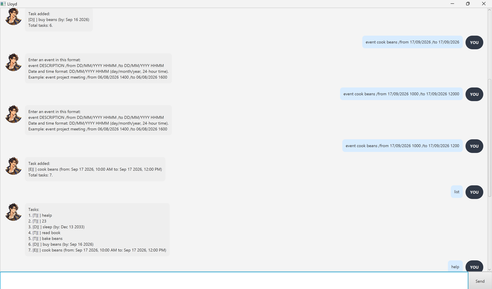

# Lloyd User Guide

Lloyd is a desktop task manager that helps you record todos, deadlines, and
events using short typed commands. It also shows what is scheduled for a date
and reminds you about urgent tasks.

- [Quick start](#quick-start)
- [Features](#features)
- [Saving your tasks](#saving-your-tasks)
- [Known limitations](#known-limitations)
- [Command summary](#command-summary)

## Quick start

1. Ensure that Java 25 or later is installed on your computer.
2. Place `lloyd.jar` in the folder where you want Lloyd to store your tasks.
3. Open a terminal in that folder and run `java -jar lloyd.jar`.
4. Type a command in the box at the bottom of the window, then press **Enter**
   or click **Send**.

Try `todo read book`, followed by `list`. Enter `help` at any time to see all
available commands. Use the **Up** and **Down** arrow keys to recall commands
you entered earlier in the session.

## Features

### Command format

- Words in `UPPER_CASE` are values that you provide. For example, replace
  `DESCRIPTION` in `todo DESCRIPTION` with `read book`.
- Items in square brackets are optional. For example, `help [COMMAND]` accepts
  both `help` and `help todo`.
- Enter command words in lowercase.
- Dates use `DD/MM/YYYY`. For example, `06/08/2026` means 6 August 2026.
- Times use the 24-hour `HHMM` format. For example, `1430` means 2:30 PM.
- `TASK_NUMBER` refers to the number beside a task in the main list shown by
  `list`.

### Viewing help: `help`

Shows all commands, or detailed guidance for one command.

Format: `help [COMMAND]`

Examples:

- `help`
- `help deadline`

### Adding a todo: `todo`

Adds a task without a date or time.

Format: `todo DESCRIPTION`

Example: `todo read book`

### Adding a deadline: `deadline`

Adds a task with a due date.

Format: `deadline DESCRIPTION /by DD/MM/YYYY`

Example: `deadline submit report /by 06/08/2026`

### Adding an event: `event`

Adds an event with a start and end date and time. The end cannot be before the
start.

Format: `event DESCRIPTION /from DD/MM/YYYY HHMM /to DD/MM/YYYY HHMM`

Example: `event project meeting /from 06/08/2026 1400 /to 06/08/2026 1600`

### Viewing all tasks: `list`

Shows every task in its current order.

Format: `list`

Lloyd uses `[T]` for todos, `[D]` for deadlines, and `[E]` for events. `[X]`
means completed, while `[ ]` means incomplete.

### Finding tasks: `find`

Shows tasks whose descriptions contain the keyword exactly as entered. The
search is case-sensitive; for example, `book` does not match `Book`.

Format: `find KEYWORD`

Example: `find book`

### Checking a date: `check`

Shows deadlines due on a date and events that start or end on that date. Todos
are not included.

Format: `check DD/MM/YYYY`

Example: `check 06/08/2026`

### Viewing reminders: `reminder`

Shows incomplete deadlines and events that are overdue or dated from today
through three calendar days later, inclusive. Deadlines use their due date;
events use their start date. Todos and completed tasks are not shown.

Format: `reminder`

The numbers shown are the tasks' positions in the main task list, so you can
use them directly with commands such as `mark` and `delete`.

### Marking a task as complete: `mark`

Marks one task as completed.

Format: `mark TASK_NUMBER`

Example: `mark 2`

### Marking a task as incomplete: `unmark`

Marks one task as incomplete again.

Format: `unmark TASK_NUMBER`

Example: `unmark 2`

### Deleting a task: `delete`

Permanently removes one task. The remaining tasks are renumbered.

Format: `delete TASK_NUMBER`

Example: `delete 2`

### Ending the session: `bye`

Ends the current session and disables further command entry. Close and reopen
Lloyd to begin another session.

Format: `bye`

## Saving your tasks

Lloyd automatically saves every successful change to `data/lloyd.txt`, in the
same folder as `lloyd.jar`. Your tasks are loaded again the next time Lloyd
starts; there is no save command.

Avoid editing the file manually. Invalid changes can prevent Lloyd from
loading your tasks. Task descriptions also cannot contain the `|` character.

## Known limitations

- The reminder period is fixed at three days and cannot be changed.
- Numbers shown by `find` are positions within the search results, not
  necessarily positions in the main task list. Run `list` before using `mark`,
  `unmark`, or `delete` on a found task.

## Command summary

| Action | Format | Example |
| --- | --- | --- |
| Add a todo | `todo DESCRIPTION` | `todo read book` |
| Add a deadline | `deadline DESCRIPTION /by DD/MM/YYYY` | `deadline submit report /by 06/08/2026` |
| Add an event | `event DESCRIPTION /from DD/MM/YYYY HHMM /to DD/MM/YYYY HHMM` | `event meeting /from 06/08/2026 1400 /to 06/08/2026 1600` |
| View all tasks | `list` | `list` |
| Find tasks | `find KEYWORD` | `find book` |
| Check a date | `check DD/MM/YYYY` | `check 06/08/2026` |
| View reminders | `reminder` | `reminder` |
| Complete a task | `mark TASK_NUMBER` | `mark 2` |
| Reopen a task | `unmark TASK_NUMBER` | `unmark 2` |
| Delete a task | `delete TASK_NUMBER` | `delete 2` |
| View help | `help [COMMAND]` | `help deadline` |
| End the session | `bye` | `bye` |
